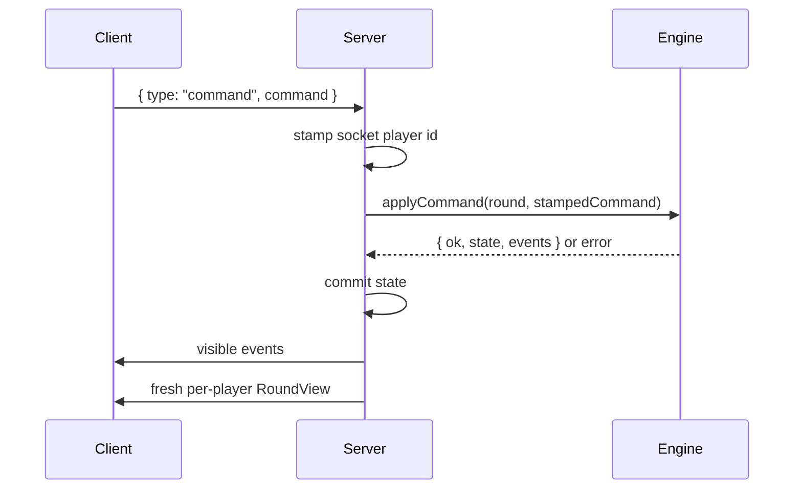

# End-to-End Data Flow

This document traces how data moves through the app from room creation to reveal.

## Room Creation

1. The browser calls `POST /rooms`.
2. `apps/server/src/main.ts` calls `createRoom`.
3. `rooms.ts` stores a new room in memory and returns a six-character code.
4. The browser navigates to `/r/[code]`.
5. `RoomClient` opens a WebSocket through `useGameSocket`.

No player exists until a `join` WebSocket message is accepted.

## Join Flow

1. The browser sends `{ type: "join", roomCode, name, color, token? }`.
2. The server finds the room.
3. If the token matches an existing player, the socket is reattached to that seat.
4. Otherwise, a lobby join creates a new player id and reconnection token.
5. The server sends `joined` to that socket.
6. The server broadcasts `lobby` to everyone in the room.

The client stores `{ playerId, token, name, color }` in `localStorage` per room code.

## Start Game Flow

1. Host sends `{ type: "startGame" }`.
2. Server checks host authority and player count.
3. Server creates a session with selected lobby toggles.
4. Server calls `createRound` with seat order, starting seat, seed, and `instantNotMe`.
5. Server broadcasts lobby state.
6. Server sends each player their own `viewFor(round, playerId)`.
7. Server starts setup-peek timers.

At this point the server has raw `RoundState`; clients only have redacted `RoundView`.

## Command Flow



The client command does not include trusted identity. The server always stamps the command with the player attached to the socket.

If the engine rejects a command, the server sends an `error` only to the player who caused it and does not commit state.

## Event Routing

The engine emits one event list after each successful command. The server loops over each event and each player:

```text
if player is connected and eventVisibleTo(event, player.id):
  send { type: "event", event }
```

Then the server broadcasts fresh per-player views:

```text
send { type: "view", view: viewFor(room.round, player.id), roundNumber }
```

This means the view is always a snapshot after the command, while events explain what just changed.

## Private Knowledge Flow

Private card knowledge is delivered only as addressed events:

- `drawnCard` goes to the drawing player.
- `peek` goes to the player granted the peek.

The web client appends those events to its local event log. `usePeeks` displays temporary card faces based on private `peek` events. Drawn cards are shown directly through `view.myDrawnCard`, which `viewFor` sets only for the current drawing player.

On reconnect, the server resends the current redacted view and timer. It does not replay old private card knowledge. A refreshed client keeps only whatever its local storage and current session still know; hidden memory is intentionally not server-restored.

## Slap Flow

1. A client sends a `slap` command with owner, slot, and the `expectedTopId` it saw.
2. The server rate-limits slap spam per player.
3. The server stamps the socket player id.
4. The engine checks whether the current DONE top still matches `expectedTopId`.
5. If the top changed, the engine emits `slapTooLate` with no penalty.
6. If the target card matches the current top by card name, the slap is correct.
7. If it was an opponent card, the engine creates `pendingGift`.
8. Until the gift resolves, most commands fail with `giftPending`.

Because the server applies each message synchronously, arrival order decides the first valid slap.

## Timer Flow

The server asks `blockingPlayers(round)` who the game is waiting on. It then starts one timeout per blocking player and broadcasts:

```json
{ "type": "turnTimer", "remainingMs": 45000, "players": ["p_..."] }
```

The browser converts `remainingMs` into a local deadline. If the timer fires, the server sends `forceSkipTurn` to the engine. The engine resolves the blocked state according to the current phase.

## Reveal and Next Round Flow

1. A player calls `callNotMe`.
2. Official rules queue final turns, unless `instantNotMe` is enabled.
3. When final turns finish, the engine reveals all lists and emits `roundRevealed`.
4. The server applies round scores to the session.
5. The room moves to `between-rounds`.
6. Lobby standings update.
7. The host may send `nextRound`.

Reveal is the only phase where all lists are public in `RoundView.result`.

## Data That Must Not Cross the Wire

Do not send:

- `RoundState`
- `deck`
- full player `list` arrays outside reveal
- `rngState`
- face-down card ids
- pending hidden card identities

Allowed client-facing shapes are described in [Rules engine](./rules-engine.md) and [Realtime server](./realtime-server.md).
