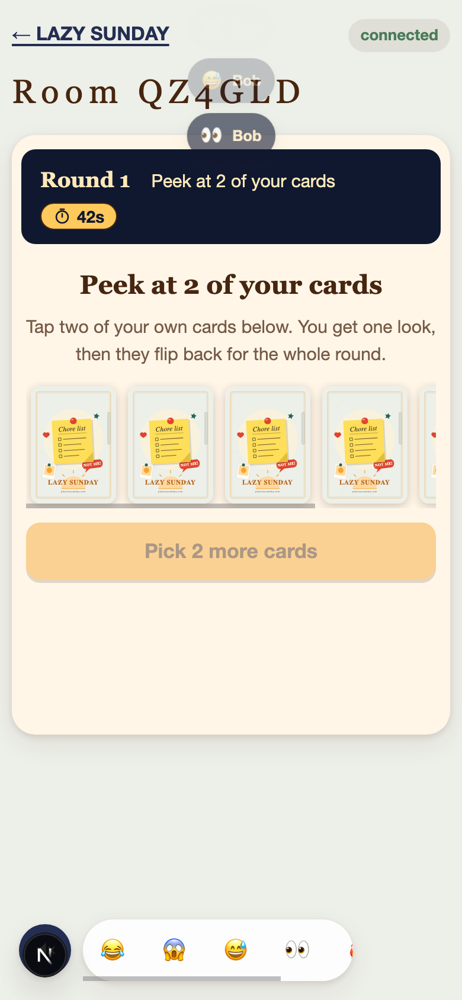
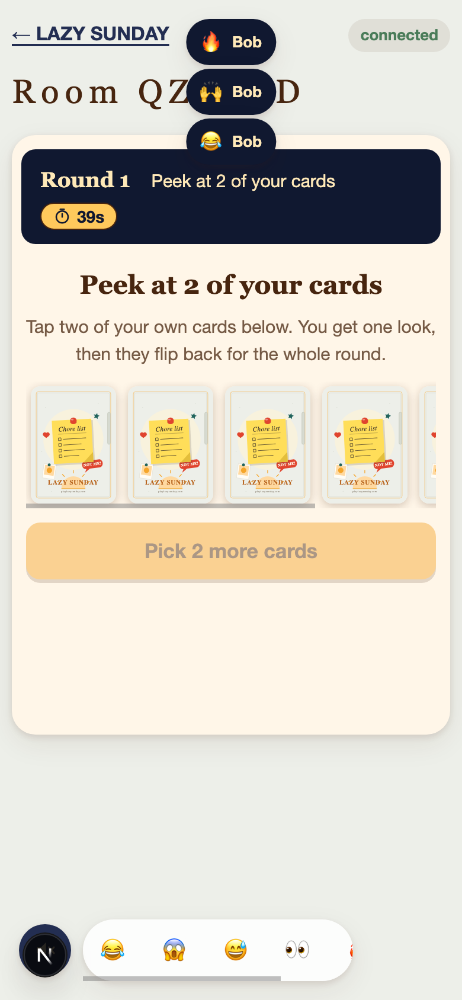

# PR 8 Reaction Stack Verification

Captured from the real local app on `feature/issue-4-reaction-stack-reflow` with:

- `npm run dev:server`
- `npm run dev:web`
- Headless Chrome at a 390 x 844 mobile viewport
- One browser player plus one WebSocket player sending rapid reactions

## Rapid Stack

Four rapid reactions were visible at once. Measured toast tops were `11`, `53`, `96`, and `139` pixels.

## Reflow After Expiry

After the oldest reaction expired, the remaining visible toasts moved upward. Measured toast tops were `15`, `59`, and `106` pixels.

## Reduced Motion

With `prefers-reduced-motion: reduce`, three reactions remained stacked, the computed animation name was `none`, and expired reactions still removed from layout.
